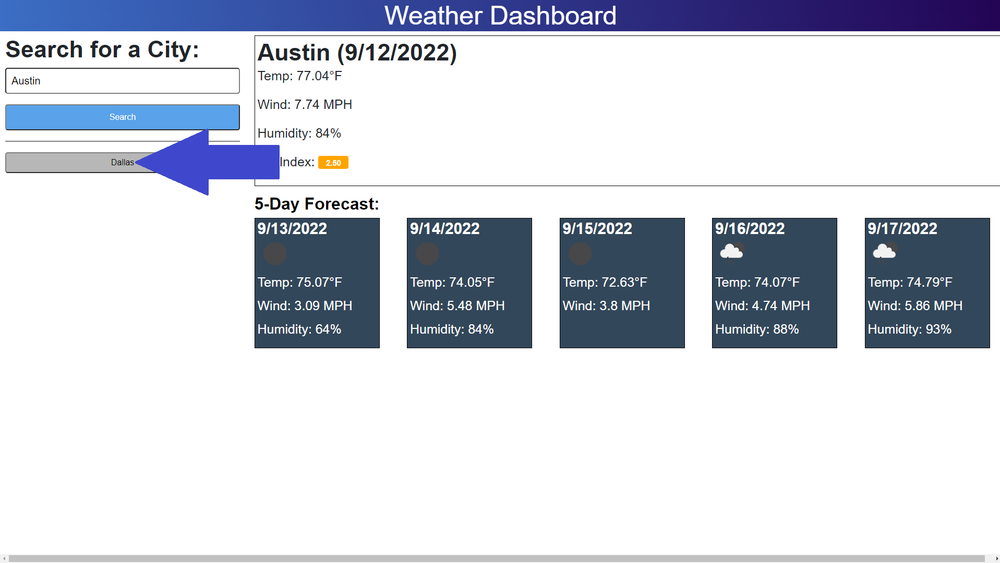

# Cool-Weather

## Description

I wanted to make this project because I wanted to be able to see weather for a city and the forecast in one place.
I learned how to use 'onclick' elements currectly, how to get data from server side api's and how to parse through the data to get exactly what I need for my website. 

## Table of Contents (Optional)

Link: https://justinsnyder611.github.io/Cool-Weather/

- [Installation](#installation)
- [Usage](#usage)
- [Credits](#credits)
- [License](#license)

## Installation

To open the project all you need to do is click the link in the 'Table of Contents' above.

## Usage

You can put a city into the input box.

Then you can press the 'search' button to see the weather information about your city!

You can also press this button to look at your previous search result!

## Credits

- https://www.w3schools.com/jsref/event_onclick.asp
- https://openweathermap.org/forecast5
- https://opencoursehub.cs.sfu.ca/bfraser/grav-cms/cmpt433/links/files/2019-student-howtos/Open-Weather-API.pdf

## License
MIT License

Copyright (c) [year] [fullname]

Permission is hereby granted, free of charge, to any person obtaining a copy
of this software and associated documentation files (the "Software"), to deal
in the Software without restriction, including without limitation the rights
to use, copy, modify, merge, publish, distribute, sublicense, and/or sell
copies of the Software, and to permit persons to whom the Software is
furnished to do so, subject to the following conditions:

The above copyright notice and this permission notice shall be included in all
copies or substantial portions of the Software.

THE SOFTWARE IS PROVIDED "AS IS", WITHOUT WARRANTY OF ANY KIND, EXPRESS OR
IMPLIED, INCLUDING BUT NOT LIMITED TO THE WARRANTIES OF MERCHANTABILITY,
FITNESS FOR A PARTICULAR PURPOSE AND NONINFRINGEMENT. IN NO EVENT SHALL THE
AUTHORS OR COPYRIGHT HOLDERS BE LIABLE FOR ANY CLAIM, DAMAGES OR OTHER
LIABILITY, WHETHER IN AN ACTION OF CONTRACT, TORT OR OTHERWISE, ARISING FROM,
OUT OF OR IN CONNECTION WITH THE SOFTWARE OR THE USE OR OTHER DEALINGS IN THE
SOFTWARE.